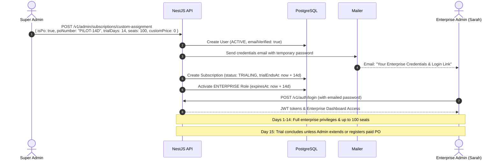
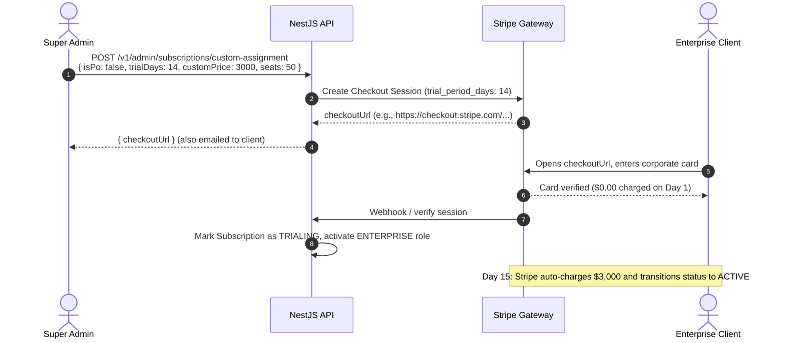

# Enterprise Free Trials, Authentication & Provisioning Guide

This document explains the technical architecture, Stripe integration, authentication mechanisms, and operational workflows for:
1. **14-Day Free Trials** (Self-serve and Admin-assigned).
2. **Password Generation & Login Flows** when admins create accounts without supplying passwords.
3. **Admin Enterprise Account Creation with Free Trials** (Offline PO Pilot vs. Online Stripe Payment Link).

---

## Table of Contents
1. [Architecture Overview](#1-architecture-overview)
2. [How 14-Day Free Trials Work (End-to-End)](#2-how-14-day-free-trials-work-end-to-end)
   - [Stripe Checkout & Authorization ($0.00 Charge)](#stripe-checkout--authorization-000-charge)
   - [Verification & Database State (`TRIALING`)](#verification--database-state-trialing)
   - [Days 1–14: Access & Cancellation](#days-114-access--cancellation)
   - [Day 15: Automatic Billing](#day-15-automatic-billing)
3. [How Login Works When No Password Is Provided](#3-how-login-works-when-no-password-is-provided)
   - [Cryptographic Password Generation](#cryptographic-password-generation)
   - [Automated Credentials Email](#automated-credentials-email)
   - [User Sign-In & First-Time Flow](#user-sign-in--first-time-flow)
   - [Fallback: Forgot Password / OTP Reset](#fallback-forgot-password--otp-reset)
4. [Enterprise Trials Created by Admin](#4-enterprise-trials-created-by-admin)
   - [Workflow A: Offline / PO Pilot Trial (No Credit Card)](#workflow-a-offline--po-pilot-trial-no-credit-card)
   - [Workflow B: Online Stripe Payment Link Trial (With Corporate Card)](#workflow-b-online-stripe-payment-link-trial-with-corporate-card)
   - [Comparison Matrix](#comparison-matrix)
5. [Team Member Provisioning During Trial](#5-team-member-provisioning-during-trial)
6. [API Contract & Request Cheatsheet](#6-api-contract--request-cheatsheet)

---

## 1. Architecture Overview

```
                      ┌──────────────────────────────────────────────┐
                      │             Enterprise Client                │
                      └──────┬────────────────────────────────┬──────┘
                             │ (Receives Credentials Email)   │ (Accesses Workspace)
                             ▼                                ▼
                ┌────────────────────────┐       ┌────────────────────────┐
                │   Frontend /login      │       │ /v1/users/me & /team   │
                └────────────┬───────────┘       └────────────┬───────────┘
                             │ (POST /v1/auth/login)          │
                             ▼                                ▼
┌─────────────────────────────────────────────────────────────────────────────┐
│                             NestJS Backend API                              │
│                                                                             │
│  ┌───────────────────────┐  ┌───────────────────────┐  ┌─────────────────┐  │
│  │  SubscriptionService  │  │      TeamService      │  │   MailService   │  │
│  │  - Free Trial logic   │  │  - Direct provision   │  │  - Credentials  │  │
│  │  - PO / Custom assign │  │  - Seat enforcement   │  │  - Welcome mail │  │
│  └──────────┬────────────┘  └──────────┬────────────┘  └─────────┬───────┘  │
└─────────────┼──────────────────────────┼─────────────────────────┼──────────┘
              │                          │                         │
              ▼                          ▼                         ▼
      ┌───────────────┐          ┌───────────────┐         ┌───────────────┐
      │ PostgreSQL DB │          │ Stripe Engine │         │  SMTP Mailer  │
      │ (Prisma ORM)  │          │ (Gateway API) │         │ (Nodemailer)  │
      └───────────────┘          └───────────────┘         └───────────────┘
```

---

## 2. How 14-Day Free Trials Work (End-to-End)

### Stripe Checkout & Authorization ($0.00 Charge)
1. **Plan Configuration**: Plans in the database specify `trialDays: Int` (e.g. `14`).
2. **Checkout Session Creation**: When checkout is initiated (`POST /v1/subscriptions/checkout`), the backend injects `subscription_data`:
   ```typescript
   // src/module/subscription/subscription.service.ts
   ...(plan.trialDays && plan.trialDays > 0
     ? { subscription_data: { trial_period_days: plan.trialDays } }
     : {})
   ```
3. **Stripe Card Authorization**:
   - The user enters their credit card details inside Stripe Checkout.
   - Stripe validates the card with a **$0.00 authorization hold** (no money is deducted).
   - Stripe marks the checkout session with:
     ```json
     {
       "payment_status": "no_payment_required",
       "status": "complete"
     }
     ```

### Verification & Database State (`TRIALING`)
When redirected to `/payment-success?session_id=...`, the frontend calls `GET /v1/subscriptions/verify?session_id=...`.

1. **Verification Logic**:
   - The backend validates that `session.payment_status` is in `['paid', 'no_payment_required']`.
   - Because `payment_status === 'no_payment_required'`, it identifies the session as a trial (`isTrialing = true`).
2. **Database Record Creation**:
   ```typescript
   // Database Subscription Record
   status: SubscriptionStatus.TRIALING,
   startedAt: new Date(),
   trialStartsAt: new Date(),
   trialEndsAt: new Date(Date.now() + 14 * 24 * 60 * 60 * 1000), // Exactly 14 days
   lastPaymentAmount: new Prisma.Decimal('0.00'),
   lastPaymentAt: null,
   seats: resolvedSeats
   ```
3. **Immediate Role Activation**:
   - Security role (`STUDENT` for B2C or `ENTERPRISE` for B2B) is granted **immediately**.
   - Entitlements are created with `status: ACTIVE`.
   - The user gets full platform access from Day 1.

### Days 1–14: Access & Cancellation
- **Full Capabilities**: During the 14 days, the user has identical platform access to a fully paid account (accessing services, team management, chat).
- **Cancellation**:
  - If the user cancels on or before Day 14 via `DELETE /v1/subscriptions/cancel`:
  - The subscription is canceled in Stripe before the trial period expires.
  - **No charge occurs. No refund or bank dispute is necessary.**

### Day 15: Automatic Billing
- At the conclusion of the 14th day (the exact timestamp of `trial_end`), Stripe automatically charges the card saved on file for the normal plan price (e.g. $49/month or $500/year).
- Upon successful payment:
  - Stripe triggers webhook / status update.
  - Subscription status changes from `TRIALING` to `ACTIVE`.
  - Next billing cycle is scheduled automatically.

---

## 3. How Login Works When No Password Is Provided

When an admin creates an account for an Enterprise Owner or Team Member without supplying a password:

### Cryptographic Password Generation
In `SubscriptionService.assignCustomSubscription` and `TeamService.directCreateMember`:
```typescript
// If admin supplies a password, use it. Otherwise, generate a 16-character hex string.
const rawPassword = dto.newUser?.password || crypto.randomBytes(8).toString('hex');
const passwordHash = await bcrypt.hash(rawPassword, 10);
```
- The user account is saved with `status: ACTIVE` and `emailVerified: true` (no email verification barrier).

### Automated Credentials Email
Immediately after account creation, the backend dispatches an email via `MailService`:
- **For Enterprise Account Owner**: `mailService.sendEnterpriseAccountCredentials(...)`
- **For Team Member**: `mailService.sendTeamMemberDirectProvisioned(...)`

#### Contents of the Email:
- **Email Address**: `user.email`
- **Temporary Password**: Clearly styled code box containing the raw generated password (e.g., `3f7b9c1d2e4a6f8b`).
- **Direct Login Link**: Button pointing to `${FRONTEND_URL}/login`.
- **Context Details**: Plan Title, Organization Name, and Purchase Order (PO) Number.

### User Sign-In & First-Time Flow
1. **User opens email** and clicks **"Sign In to Enterprise Workspace"**.
2. **User enters**:
   - Email: `sarah.admin@megacorp.com`
   - Password: `3f7b9c1d2e4a6f8b`
3. Backend validates password via bcrypt in `POST /v1/auth/login` and returns JWT `accessToken`, `refreshToken`, and user object.
4. User accesses their dashboard and can change their temporary password at any time via **Profile Settings** (`PATCH /v1/users/profile`).

### Fallback: Forgot Password / OTP Reset
If the user did not receive or cannot find the email:
1. User navigates to `/login` and clicks **"Forgot Password?"**.
2. Submits email via `POST /v1/auth/forgot-password`.
3. Backend sends a 6-digit OTP to their email.
4. User verifies OTP (`POST /v1/auth/verify-reset-password-otp`) and sets a new permanent password (`POST /v1/auth/reset-password`).

---

## 4. Enterprise Trials Created by Admin

Admins can provision Enterprise trials using one of two workflows:

### Workflow A: Offline / PO Pilot Trial (No Credit Card)
> **Use case:** Enterprise sales pilots, government contracts, or corporate evaluations where procurement prohibits entering a credit card upfront.



#### Admin Payload:
```http
POST /v1/admin/subscriptions/custom-assignment
Authorization: Bearer <super_admin_jwt>
Content-Type: application/json

{
  "isPo": true,
  "poNumber": "PILOT-14D-MEGACORP",
  "newUser": {
    "email": "sarah.admin@megacorp.com",
    "firstName": "Sarah",
    "lastName": "Director",
    "companyName": "MegaCorp Industries"
  },
  "targetAudience": "B2B",
  "seats": 100,
  "planTitle": "MegaCorp 14-Day Enterprise Pilot",
  "trialDays": 14,
  "customPrice": 0,
  "billingInterval": "MONTHLY"
}
```

#### Database State:
- `Subscription.status`: `SubscriptionStatus.TRIALING`
- `Subscription.trialStartsAt`: Current date
- `Subscription.trialEndsAt`: Current date + 14 days
- `Subscription.seats`: 100
- `Subscription.lastPaymentAmount`: `0.00`
- `UserRole.expiresAt`: Current date + 14 days

---

### Workflow B: Online Stripe Payment Link Trial (With Corporate Card)
> **Use case:** Deals where the client agrees to a recurring subscription (e.g., $3,000/month), gets the first 14 days free, but must enter a corporate card upfront so billing starts automatically on Day 15.



#### Admin Payload:
```http
POST /v1/admin/subscriptions/custom-assignment
Authorization: Bearer <super_admin_jwt>
Content-Type: application/json

{
  "isPo": false,
  "newUser": {
    "email": "sarah.admin@megacorp.com",
    "firstName": "Sarah",
    "lastName": "Director"
  },
  "targetAudience": "B2B",
  "seats": 50,
  "planTitle": "Enterprise Custom Monthly",
  "trialDays": 14,
  "customPrice": 3000,
  "billingInterval": "MONTHLY"
}
```

---

### Comparison Matrix

| Dimension | Workflow A: Offline PO Pilot (`isPo: true`) | Workflow B: Stripe Payment Link (`isPo: false`) |
| :--- | :--- | :--- |
| **Credit Card Required?** | ❌ No credit card needed | ✅ Corporate card required upfront |
| **Initial Charge** | $0.00 | $0.00 (authorization only) |
| **Subscription Status** | `SubscriptionStatus.TRIALING` | `SubscriptionStatus.TRIALING` |
| **Account Creation** | Instant on the fly | Instant on the fly |
| **Credentials Delivery** | Automated email with temporary password | Automated email + Stripe link |
| **Seats & Privileges** | Full access to provision team members up to limit | Full access to provision team members up to limit |
| **What happens on Day 15?** | Trial access expires unless Admin converts to paid PO | Stripe **automatically charges** card and moves to `ACTIVE` |

---

## 5. Team Member Provisioning During Trial

Even while on a 14-day trial, the Enterprise Account Owner or Delegated Admin can invite or directly provision team members up to the allocated seat limit.

### Single Member Direct Creation
```http
POST /v1/team/members/direct
Authorization: Bearer <enterprise_jwt>
Content-Type: application/json

{
  "email": "engineer.one@megacorp.com",
  "firstName": "John",
  "lastName": "Doe",
  "role": "MEMBER"
}
```
- Password is automatically generated and emailed to the new member.
- Member is associated with the Enterprise parent account (`parentUserId`).
- Seat usage counter increments by 1.
- Member inherits enterprise features immediately.

---

## 6. API Contract & Request Cheatsheet

### 1. Check Current User & Trial Status
```http
GET /v1/users/me
Authorization: Bearer <jwt_token>
```
**Response snippet:**
```json
{
  "statusCode": 200,
  "data": {
    "id": "usr_98a72e81",
    "email": "sarah.admin@megacorp.com",
    "roles": ["ENTERPRISE"],
    "subscription": {
      "status": "TRIALING",
      "isTrialing": true,
      "trialStartsAt": "2026-09-17T12:00:00.000Z",
      "trialEndsAt": "2026-10-01T12:00:00.000Z",
      "daysRemaining": 14,
      "seats": 100
    },
    "teamContext": {
      "isTeamMember": false,
      "isAccountOwner": true,
      "teamRole": "ADMIN",
      "seatsAllocated": 100,
      "seatsUsed": 1
    }
  }
}
```

### 2. Super Admin Custom Assignment / Trial Provisioning
```http
POST /v1/admin/subscriptions/custom-assignment
Authorization: Bearer <super_admin_jwt>
```
| Property | Type | Description |
| :--- | :--- | :--- |
| `newUser` | `Object` | `{ email, firstName, lastName, password? }`. Auto-creates account if user does not exist. |
| `userId` | `String (UUID)` | Provide existing user ID if user already exists. |
| `isPo` | `Boolean` | `true` for offline PO/pilot (no Stripe CC). `false` for online Stripe payment link. |
| `poNumber` | `String` | Required when `isPo: true`. Purchase Order or Pilot Reference number. |
| `trialDays` | `Number` | Trial length in days (e.g. `14`). Sets `SubscriptionStatus.TRIALING`. |
| `seats` | `Number` | Number of team member seats allocated to the enterprise workspace. |
| `customPrice` | `Number` | Agreed price in `currency`. (Use `0` for free pilot). |
| `billingInterval` | `MONTHLY \| YEARLY` | Billing cadence for renewal. |
